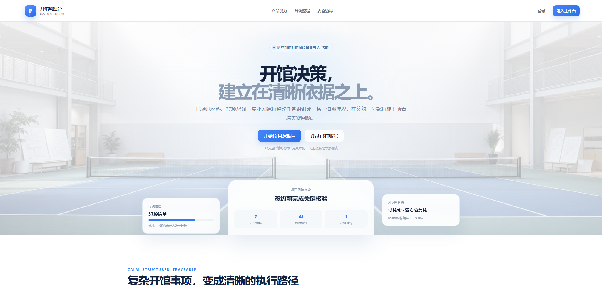
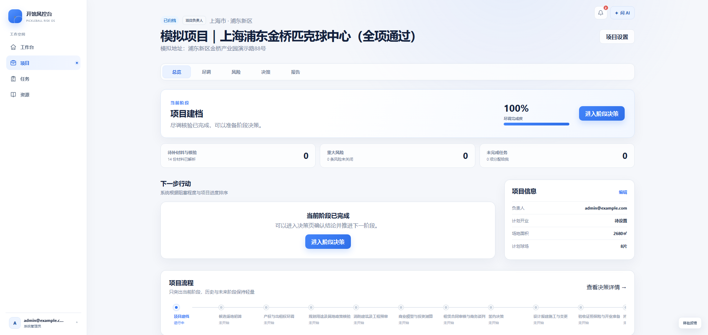
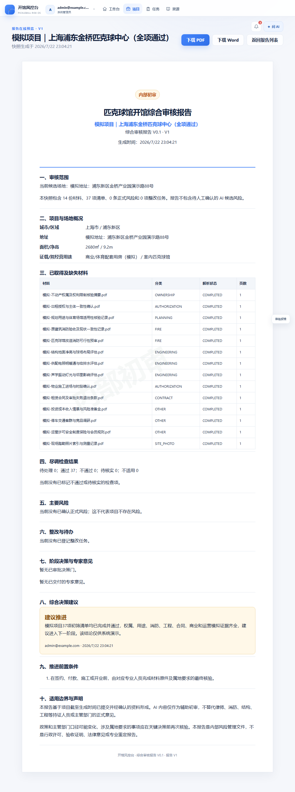

# 匹克球俱乐部开馆风控台（Risk SOP）

匹克球俱乐部开馆风控台是一套面向匹克球馆筹建与开业决策的风险管理系统。项目围绕选址、签约、建设、验收和开业准备等关键阶段，把分散的场地材料、专业尽调、风险事项、整改任务和决策依据组织成可追踪、可复核、可审计的管理链路。

  

## 项目作用

- 在签约、付款和施工前识别土地用途、规划、消防、结构、租赁、工程、经营许可及周边关系等关键风险。
- 将候选场地、尽调清单、证明材料、风险台账、整改任务和决策报告统一关联，减少信息分散与责任遗漏。
- 为不同专业领域建立标准化核验框架，使项目团队能够持续掌握风险状态、证据完整性和整改进展。
- 保留材料来源、判断依据、人工确认、专家意见和历史版本，形成完整的证据链与决策审计记录。
- 通过知识库和 AI 辅助整理材料、发现疑点、生成候选意见，提升前期尽调和风险复核效率。
- 支持多个候选场地的商业条件与合规风险比较，为继续推进、附条件推进、暂缓或放弃提供依据。

项目风险、尽调进度、待办事项和阶段决策被汇总到同一项目上下文中，帮助团队及时识别阻塞问题并明确下一步行动。

  

审核结果可形成带有材料清单、尽调结论、风险事项、整改情况、人工决策和适用边界的版本化报告，为关键决策保留完整依据。

  

> 图片中的场地、材料和结论均为演示信息，不对应真实项目。

## 管理闭环

系统以“材料归集 → 专业核验 → 风险识别 → 整改跟踪 → 专家复核 → 人工决策 → 报告留档”为核心闭环，帮助筹建团队在关键投入发生前看清问题、明确责任并保留依据。

## 责任边界

AI 只提供材料整理、风险提示和候选意见，不会自动形成正式风险或最终决策。正式结论须由用户人工确认；涉及法律、消防、建筑结构、财税等依法需要专业资质的事项，应由具备相应资质的专业人员复核。

## 参与贡献

欢迎围绕专业尽调框架、风险规则、证据审计、权限安全、AI 人工审核机制、知识库质量和项目文档提交改进建议或代码贡献。

贡献内容应遵守以下原则：

- 不提交真实客户材料、个人信息、账号凭据、API Key 或其他敏感数据。
- 不绕过 AI 候选结论进入正式风险、知识或报告前的人工审核门禁。
- 涉及法律、消防、结构、财税等专业规则时，提供可核验来源并明确适用范围。
- 保持变更可审查、可测试，并说明对既有数据和审计链的影响。

具体要求见 [贡献指南](CONTRIBUTING.md) 和 [社区行为准则](CODE_OF_CONDUCT.md)。

## 开源说明

本项目采用 [MIT License](LICENSE) 开源，可在许可证允许的范围内使用、复制、修改和分发。项目依赖的第三方软件分别遵循其自身许可证。

本项目按“现状”提供，不承诺适用于所有地区、场地或业务情形。使用方应自行完成安全、隐私、数据保留和属地合规评估；AI 输出和系统报告不构成行政许可、验收证明、法律意见或专业鉴定结论。
